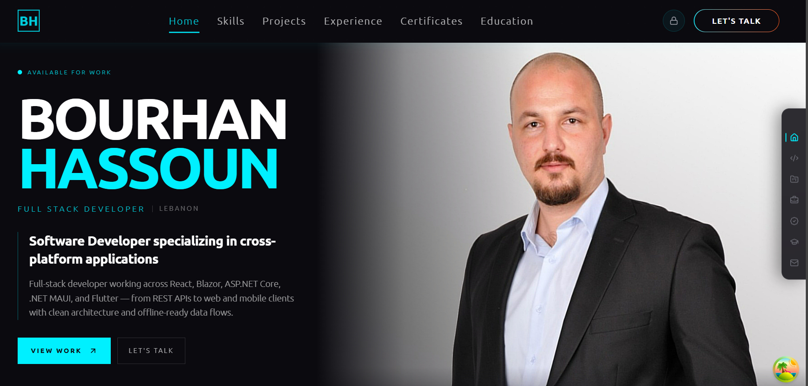
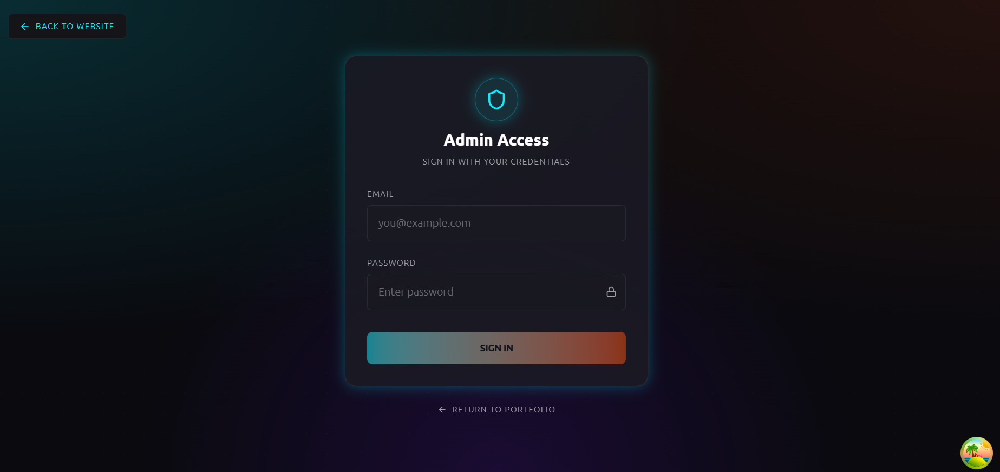
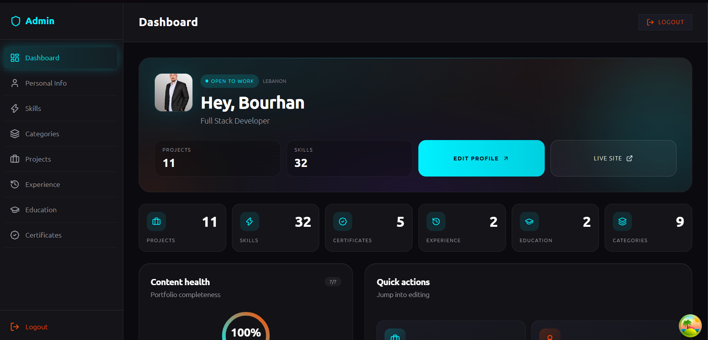
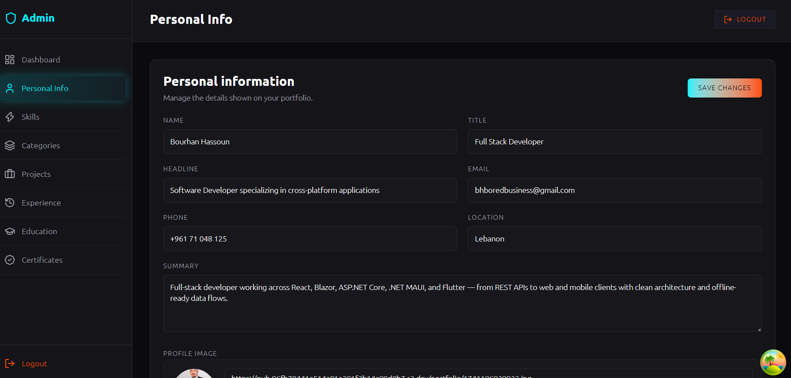
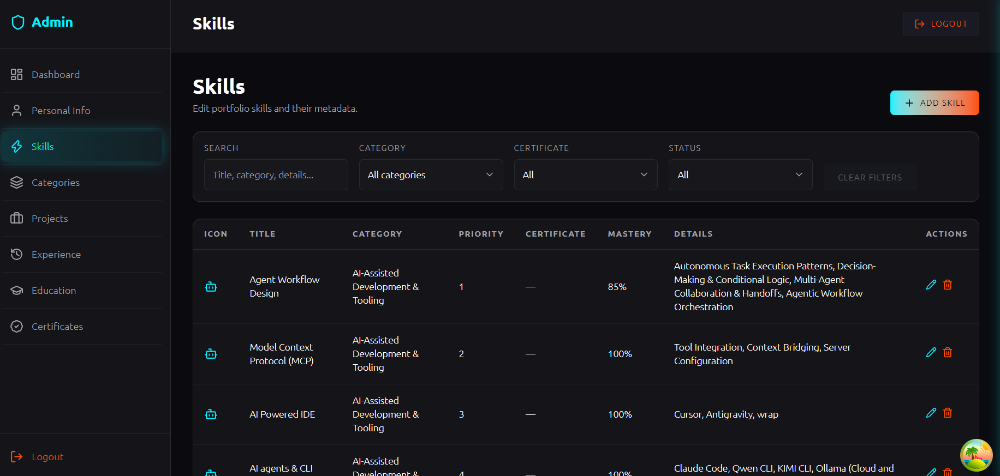
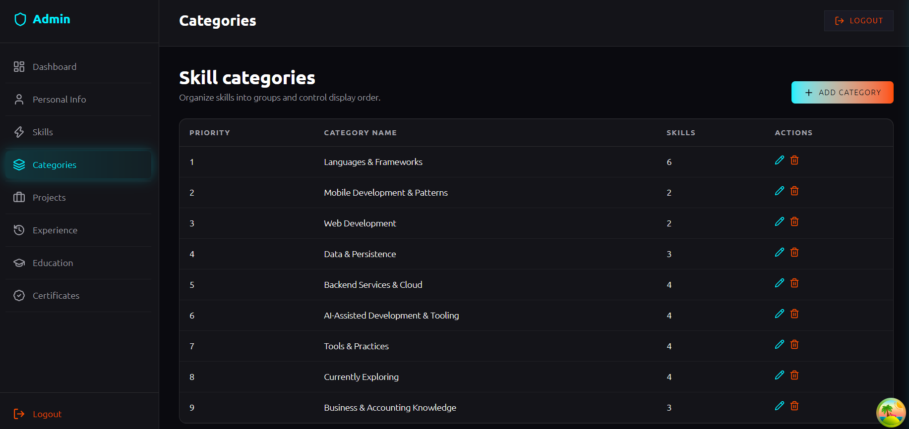
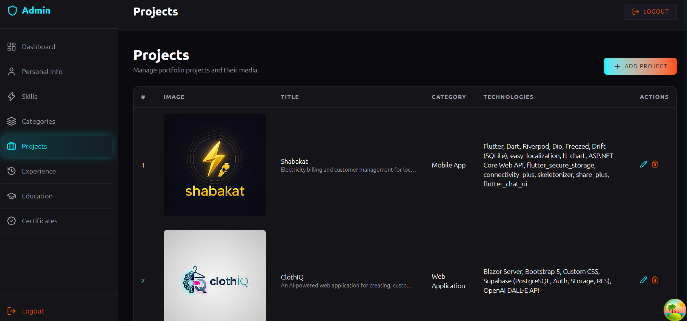
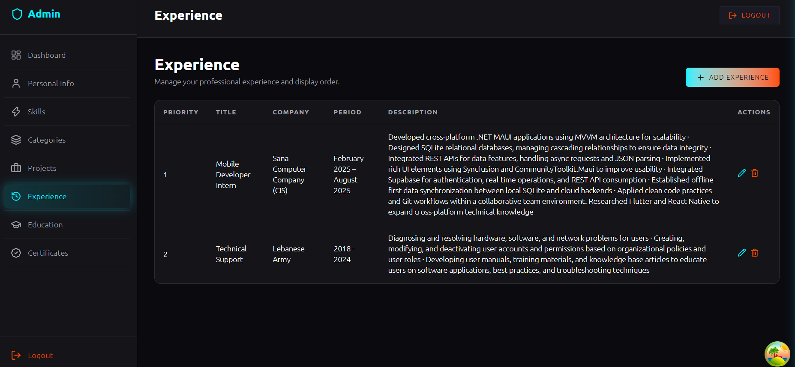
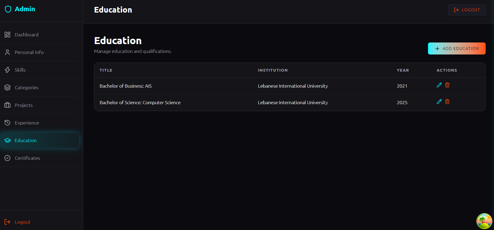
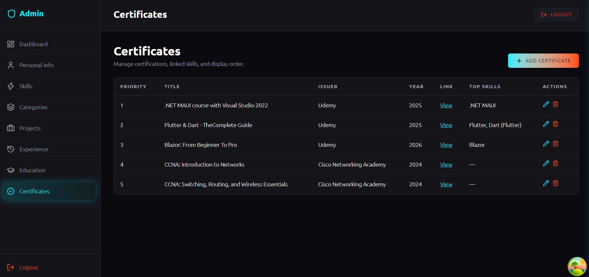

# Bourhan Hassoun — Portfolio

Personal portfolio site with a public landing page and a protected admin CMS. Content (projects, skills, experience, education, certificates, and personal info) is managed in the admin dashboard and served from Supabase, with images stored on Cloudflare R2.

**Stack:** React 19 · TypeScript · Vite · Tailwind CSS · GSAP · TanStack Query · Supabase · React Router

---

## Screenshots

### Landing page

<table border="1" cellpadding="10" cellspacing="0" width="100%">
  <tr>
    <td align="center" valign="top">
      
      <br />
      <strong>Landing page</strong>
    </td>
  </tr>
</table>

### Admin dashboard

<table border="1" cellpadding="10" cellspacing="0" width="100%">
  <tr>
    <td align="center" valign="top" width="50%">
      
      <br />
      <strong>Login</strong>
    </td>
    <td align="center" valign="top" width="50%">
      
      <br />
      <strong>Dashboard</strong>
    </td>
  </tr>
  <tr>
    <td align="center" valign="top" width="50%">
      
      <br />
      <strong>Personal Info</strong>
    </td>
    <td align="center" valign="top" width="50%">
      
      <br />
      <strong>Skills</strong>
    </td>
  </tr>
  <tr>
    <td align="center" valign="top" width="50%">
      
      <br />
      <strong>Categories</strong>
    </td>
    <td align="center" valign="top" width="50%">
      
      <br />
      <strong>Projects</strong>
    </td>
  </tr>
  <tr>
    <td align="center" valign="top" width="50%">
      
      <br />
      <strong>Experience</strong>
    </td>
    <td align="center" valign="top" width="50%">
      
      <br />
      <strong>Education</strong>
    </td>
  </tr>
  <tr>
    <td align="center" valign="top" width="50%">
      
      <br />
      <strong>Certificates</strong>
    </td>
    <td align="center" valign="top" width="50%"></td>
  </tr>
</table>

---

## Features

### Public site
- Hero / personal intro with availability status
- Skills, projects, experience, certificates, and education sections
- Project detail pages with screenshot galleries
- Contact form and language info

### Admin dashboard (`/admin`)
- Auth-protected CMS for all portfolio content
- Dashboard overview (content health, skills snapshot, recent projects)
- CRUD for personal info, skills, categories, projects, experiences, educations, and certificates
- Image uploads to Cloudflare R2 via a Supabase Edge Function

---

## Getting started

### Prerequisites
- Node.js 20+
- A Supabase project (run [`schema.sql`](schema.sql) in the SQL Editor to create tables)
- Cloudflare R2 bucket + upload Edge Function (see `docs/R2-upload-setup.md`)

### Install

```bash
npm install
```

### Environment

Copy `.env.example` to `.env` and fill in your values:

```bash
cp .env.example .env
```

| Variable | Purpose |
| --- | --- |
| `VITE_SUPABASE_URL` | Supabase project URL |
| `VITE_SUPABASE_ANON_KEY` | Supabase anon / publishable key |
| `VITE_R2_BASE_FOLDER` | Root folder prefix in the R2 bucket |
| `VITE_R2_PUBLIC_URL_BASE` | Public base URL for uploaded assets |
| `VITE_UPLOAD_FUNCTION_URL` | Supabase Edge Function URL for image uploads |
| `VITE_SITE_URL` | Canonical site URL (SEO / metadata) |

### Run

```bash
npm run dev
```

### Build

```bash
npm run build
npm run preview
```

---

## Project structure

```
src/
  app/
    features/     # landing, projects, skills, admin, etc.
    providers/    # auth + landing data
    routes/       # admin + project detail routes
    shared/       # layout, API helpers, shared UI
  lib/            # upload, proficiency helpers, etc.
public/
  screenshots/    # landing + admin screenshots
schema.sql        # Supabase table schema (no data / no RLS)
```

Public portfolio: `/`  
Admin login: `/admin/login`  
Admin CMS: `/admin`

---

## Scripts

| Command | Description |
| --- | --- |
| `npm run dev` | Start Vite dev server |
| `npm run build` | Typecheck + production build |
| `npm run preview` | Preview production build |
| `npm run lint` | Run ESLint |

---

## License

Private — all rights reserved.
